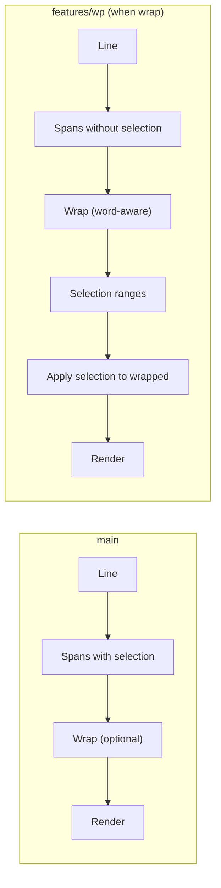
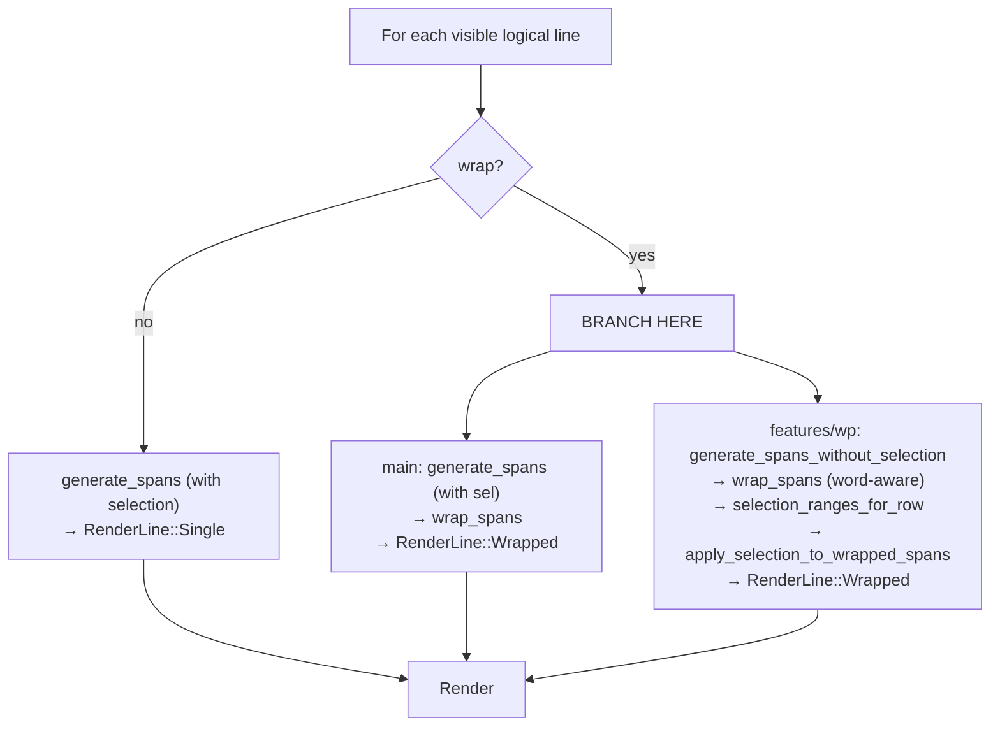

# Line Management: main vs features/wp

This document summarizes the **differences** between the main branch and the features/wp branch for line/span/selection handling, and outlines **benefits**, **drawbacks**, and **possible issues** of each approach.

*(Note: The branch name is `features/wp`; “wp” is used below.)*

---

## 1. Pipeline Comparison

| Aspect | main | features/wp (wrap on) |
|--------|------|------------------------|
| **Order** | Selection (and syntax) → then wrap | Wrap → then selection (and syntax already in spans before wrap) |
| **Wrap input** | Spans that may have many boundaries (selection/syntax) | Single-style or syntax-only spans (no selection) |
| **Selection on wrapped lines** | Implicit (already in spans before wrap) | Explicit: logical ranges → `apply_selection_to_wrapped_spans` |
| **Word boundaries** | No (split at width only) | Yes (`get_split_at_word`) |
| **Length / indexing** | Some `.len()` (byte) | `.chars().count()` (character) for spans/ranges |

---

## 2. main Branch

### How it works

- For every visible logical line we call **`generate_spans`** with the current selections (and optional syntax highlighter). That produces `Vec` with selection (and syntax) already applied — so we get multiple spans per line (normal vs highlighted).
- If wrap is on, **`LineWrapper::wrap_spans`** wraps this `Vec`. Wrap happens at width limits; if a span boundary falls near the wrap width, the break can occur at that boundary.
- Result is `RenderLine::Single` or `RenderLine::Wrapped`; same structure used for cursor position and rendering.

### Benefits

- **Simple mental model:** One path: “stylize line (selection + syntax), then wrap”. No separate “apply selection to wrapped” step.
- **Less code:** No `selection_ranges_for_row`, no `apply_selection_to_wrapped_spans`, no `generate_spans_without_selection` in the render path.
- **Selection and wrap in one pass:** No need to map logical selection ranges onto wrapped lines; selection is already in the spans that get wrapped.

### Drawbacks

- **Wrap points can depend on selection/syntax:** Because we wrap **after** applying selection/syntax, span boundaries (e.g. at selection edges) can influence where the line wraps. Resizing or changing selection can change wrap points, which can feel odd (e.g. line reflows when you select).
- **No word-boundary wrapping:** Long words are split at a fixed width; we don’t try to break at spaces.
- **Possible byte vs character confusion:** Using `.len()` in a few places (e.g. `InternalSpan::spans_len`, `crop_spans`) is byte length. For ASCII it’s fine; for Unicode (emoji, combining chars) column indices are character-based elsewhere, so there can be inconsistency.

### Possible issues

- **Selection-driven reflow:** With wrap on, selecting across a long line can change the number of wrapped rows and scroll position.
- **Unicode:** Any logic that relies on `content.len()` for “column” or “length” may misalign with `Index2.col` or selection ranges that are character-based.

---

## 3. features/wp Branch

### How it works

- **When wrap is off:** Same as main: `generate_spans` with selection (and syntax) → `RenderLine::Single`.
- **When wrap is on:**
  1. **`generate_spans_without_selection`** builds spans with no selection (plain or syntax-only). So wrap sees a stable, minimal set of span boundaries.
  2. **`LineWrapper::wrap_spans`** wraps those spans, with **word-boundary** logic: we prefer to break after whitespace.
  3. **`selection_ranges_for_row`** computes disjoint `(start_col, end_col)` ranges for that logical row from all selections.
  4. **`apply_selection_to_wrapped_spans`** walks each wrapped line, maps logical character range to line-local columns, and uses `InternalSpan::split_at_selection` to apply highlight. Handles `col_skips` (horizontal scroll) via `logical_offset`.

So: **wrap first (stable, word-aware), then paint selection on top** in logical character space.

### Benefits

- **Stable wrap:** Wrap points do not depend on selection or highlight. Resizing or changing selection doesn’t change where lines break; only content and width matter.
- **Word-boundary wrapping:** More readable; we avoid breaking in the middle of a word when there’s a space earlier.
- **Unicode-consistent:** Using `chars().count()` for span length and offsets keeps selection ranges and column indices in the same (character) space, which is important for emoji and combining characters.
- **Clear separation:** “Layout” (wrap) is independent of “highlight” (selection); easier to reason about and to extend (e.g. other overlays).

### Drawbacks

- **More code and two paths:** Wrap-on path has extra helpers (`selection_ranges_for_row`, `apply_selection_to_wrapped_spans`, `generate_spans_without_selection`). No-wrap path still uses the old “spans with selection” path, so there are two ways selection gets onto the screen.
- **Double work when wrap is on:** We build spans without selection, wrap, then walk wrapped lines again to apply selection. Main does selection once per logical line then wraps.
- **Range math:** `apply_selection_to_wrapped_spans` must track `logical_offset` and map (start_col, end_col) to each wrapped segment; off-by-one or edge cases (empty lines, full-line selection) need care.

### Possible issues

- **Performance:** For wrapped lines we do: generate spans (no sel) → wrap → ranges → apply selection. For many long wrapped lines this can be more work than main’s “one pass + wrap”.
- **Consistency of “no wrap” vs “wrap”:** No-wrap still uses “spans with selection” (main behavior). So behavior is identical to main when wrap is off; only the wrap-on path differs. That’s intentional but worth keeping in mind when debugging (e.g. “selection looks wrong” only when wrap is on).
- **Word-boundary edge cases:** Very long words with no space still break mid-word; multiple spaces or tabs can affect where we break. Generally acceptable but worth testing.

---

## 4. Side-by-Side Summary

| Topic | main | features/wp (wrap on) |
|-------|------|----------------------|
| **Wrap stability** | Can change with selection/syntax | Stable; independent of selection |
| **Word boundaries** | No | Yes |
| **Unicode (length)** | Some `.len()` risk | `.chars().count()` used |
| **Code size** | Smaller render path | Larger; extra helpers |
| **Selection application** | In spans before wrap | Ranges applied after wrap |
| **Possible bugs** | Selection-driven reflow, byte vs char | Range/offset logic, two code paths |

---

## 5. When to Prefer Which

- **Prefer main** if you want the simplest pipeline and don’t care about wrap stability or word boundaries, and content is mostly ASCII.
- **Prefer features/wp** if you want wrap to be stable under selection/syntax, word-boundary wrapping, and consistent character-based lengths for Unicode. The extra complexity is in the wrap-on path only; no-wrap is unchanged.

---

## 6. Diagram: Where the Branches Diverge

The only behavioral difference is the **wrap-on** path; the data model (Lines, Index2, Selection, ViewState) and the no-wrap path are the same on both branches.
