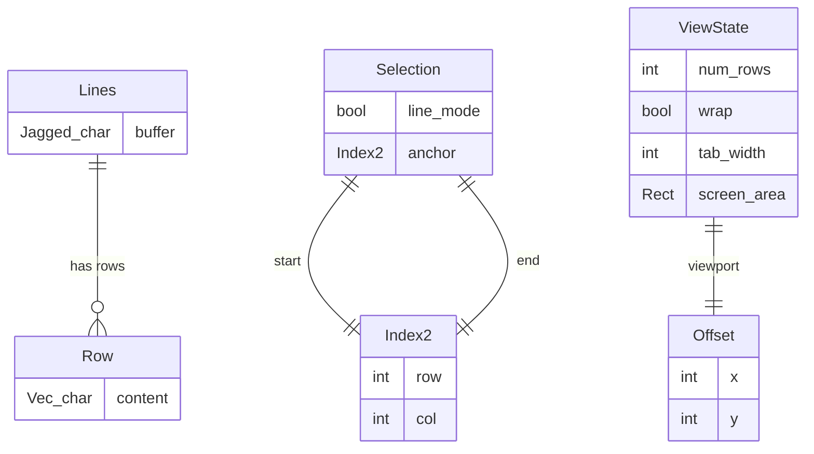
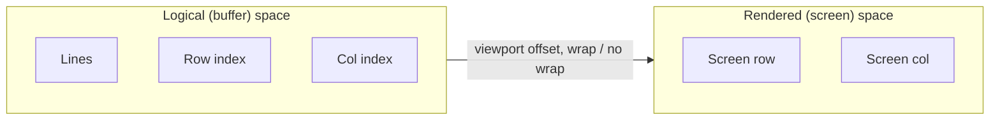
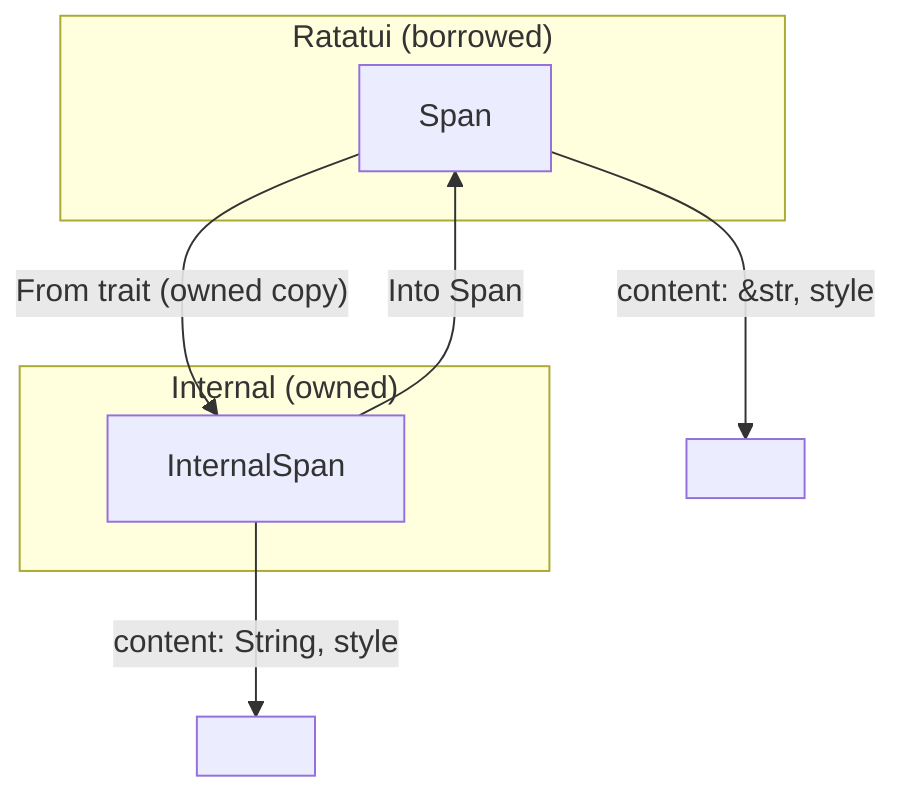
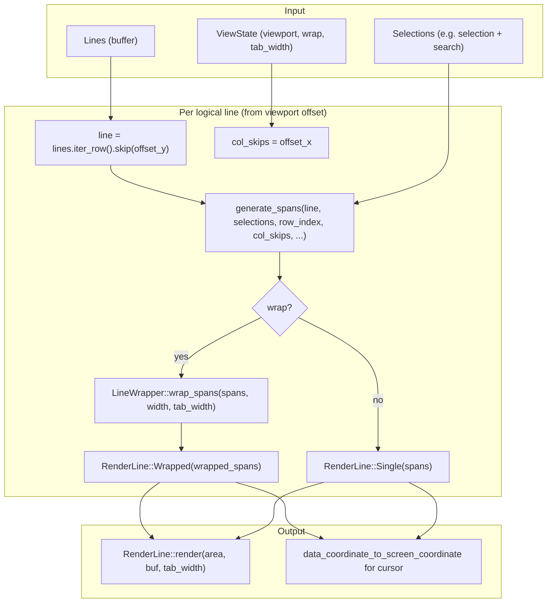
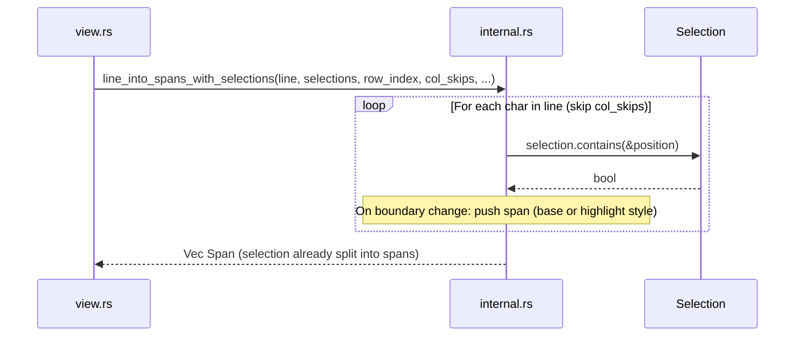
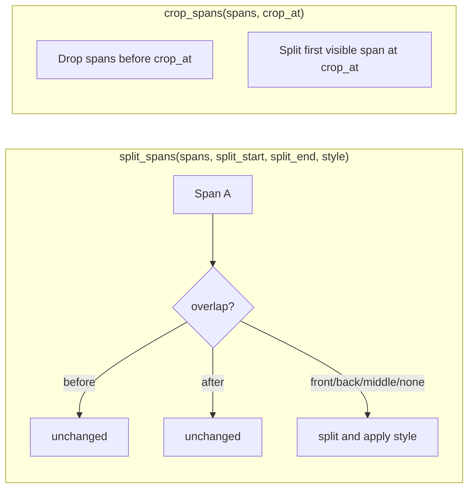
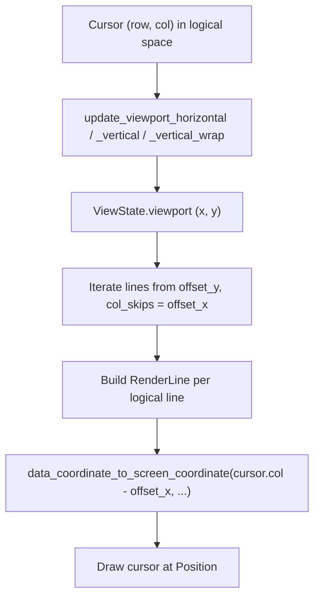
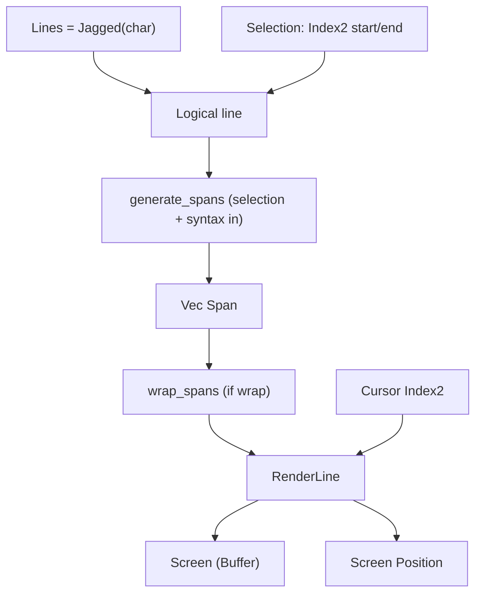

# Line Management on `main` Branch

This document describes how **actual text lines**, **rendered lines**, **spans**, **internal spans**, and **selections** work together in the edtui codebase on the **main** branch.

---

## 1. Data Model Overview

- **`Lines`** (`jagged::Jagged<char>`): The buffer. Each **row** is one logical line (`Vec<char>`). Indexed by `RowIndex`.
- **`Index2`**: `(row, col)` in **logical** coordinates (row = logical line index, col = character index).
- **`Selection`**: `start`, `end` (`Index2`), optional `line_mode` and `anchor`. All coordinates are in **logical** space (lines and columns).
- **`ViewState`**: Viewport offset `(x, y)` (column/row scroll), `num_rows` (number of logical lines visible), wrap/tab/line-number settings.

---

## 2. Coordinate Spaces

| Space        | Row meaning              | Col meaning        | Used by                    |
|-------------|---------------------------|--------------------|----------------------------|
| **Logical** | Index into `Lines` (line) | Character index    | `Selection`, `Index2`, cursor |
| **Screen**  | Y in terminal            | X in terminal      | Cursor draw, mouse → logical |

- **No wrap:** 1 logical line → 1 screen row; horizontal scroll = `viewport.x`.
- **Wrap:** 1 logical line → 1+ screen rows (via `LineWrapper`); vertical scroll = `viewport.y` over **logical** lines; `find_position_in_wrapped_spans` maps logical column to (wrapped row, screen col).

---

## 3. Span Types

- **`Span<'a>`** (ratatui): Borrowed content, used for rendering and in `LineWrapper::wrap_spans`.
- **`InternalSpan`**: Owned `String` + `Style`. Used for syntax highlighting and selection splitting so we can mutate and pass without lifetimes. Converts to/from `Span` for the rest of the pipeline.

---

## 4. Render Pipeline (main branch)

**Order on main: selection → then wrap.**

1. For each visible logical line, **`generate_spans`** builds `Vec` with **selection (and syntax) already applied** (`line_into_spans_with_selections` or highlighted variant).
2. If **wrap** is on, **`LineWrapper::wrap_spans`** wraps these already-styled spans. Wrap boundaries can fall at span boundaries (e.g. selection/syntax boundaries).
3. Result is **`RenderLine::Single(spans)`** or **`RenderLine::Wrapped(Vec<Vec>)`**, then rendered and used for cursor position.

---

## 5. Selection Application (main)

- Selection is **per character**: for each `Index2(row_index, col)` we check `selection.contains(&pos)` and switch between base and highlight style. So we get **multiple spans per line** (normal vs selected).
- **Syntax highlighting (main):** `line_into_highlighted_spans_with_selections` first gets highlighted `InternalSpan`s, then **splits at selection** via `InternalSpan::split_at_selection` (which uses `split_spans` at `(start_col, end_col)`), then `crop_spans(col_skips)` for horizontal scroll. Result converted to `Span`s.

---

## 6. InternalSpan and Splitting

- **`split_spans`**: Given a single logical row’s spans and a column range `(split_start, split_end)`, produces new spans with the given `style` in that range (for selection/syntax). Handles overlap cases (span fully inside, overlaps start/end, or spans multiple).
- **`crop_spans`**: Horizontal scroll: drop or trim spans so that the first visible character is at `crop_at` (character index).

---

## 7. Cursor and Viewport

- **Scroll:** Viewport is updated so the cursor stays visible (scroll left/right without wrap, or scroll up/down by logical line with wrap).
- **Cursor draw:** For the logical line that contains the cursor, we call `render_line.data_coordinate_to_screen_coordinate(cursor.col - offset_x, area, tab_width)`. For wrapped mode this uses **`find_position_in_wrapped_spans`** (logical column → wrapped row + display width col).

---

## 8. Summary Diagram (main)

**Takeaway (main):** Everything is driven by **logical lines** and **logical (row, col)**. Spans are produced **with selection (and syntax) applied first**; then wrapping is applied to those spans. Selection and span boundaries can therefore affect where wrapping occurs.
