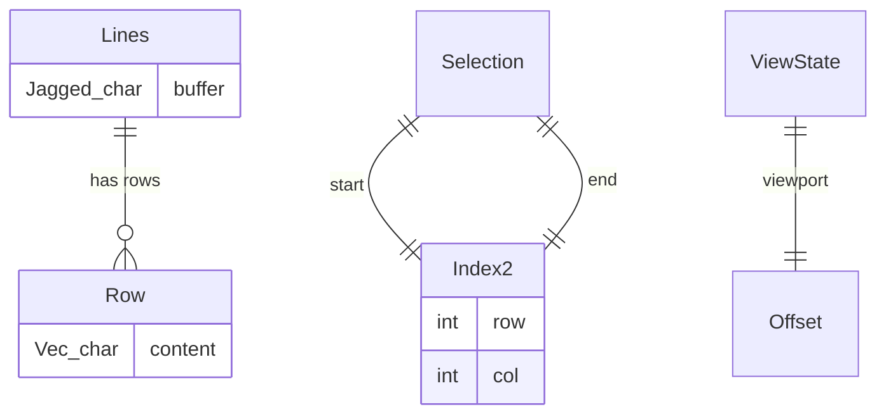
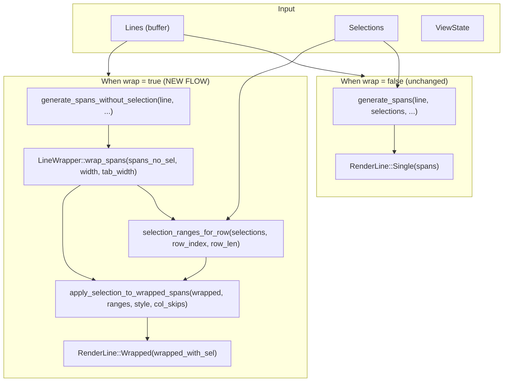
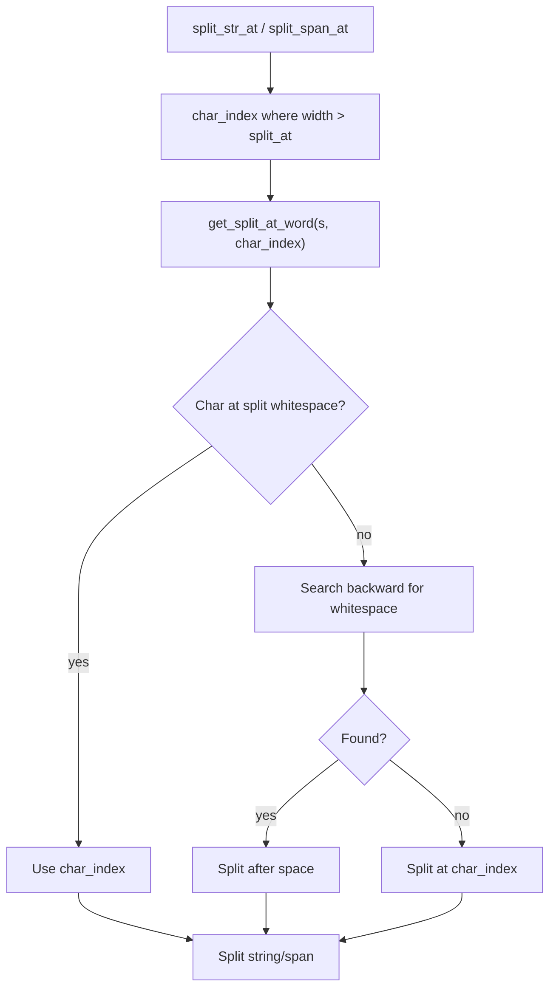
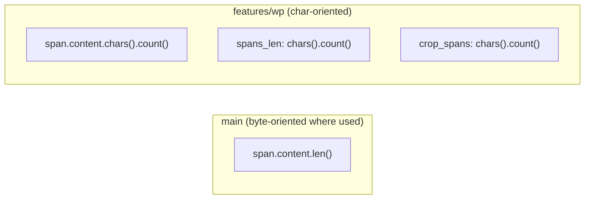
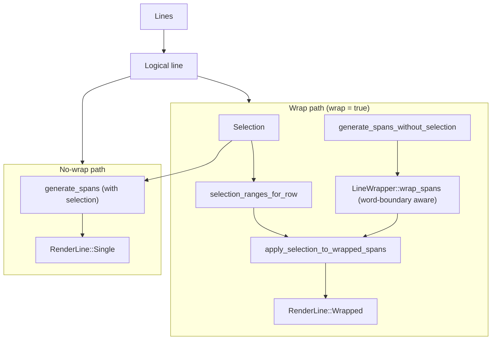

# Line Management on `features/wp` Branch

This document describes how **actual text lines**, **rendered lines**, **spans**, **internal spans**, and **selections** work together in the edtui codebase on the **features/wp** branch. The main difference from `main` is the **wrap-first, selection-after** pipeline and Unicode/word-boundary handling.

---

## 1. Data Model Overview

Same as main:

- **`Lines`**, **`Index2`**, **`Selection`**, **`ViewState`** are unchanged in meaning: logical lines, logical (row, col), viewport offset.

---

## 2. Coordinate Spaces

Same as main: **logical** (buffer line/column) vs **screen** (terminal row/col). Mapping is the same; only the way we build spans for wrapped lines changes (see pipeline below).

---

## 3. Span Types

Same as main: **`Span<'a>`** (ratatui, borrowed) and **`InternalSpan`** (owned String + Style). On features/wp, **lengths and offsets use `chars().count()`** instead of `.len()` where it matters (Unicode-correct splitting and selection ranges).

---

## 4. Render Pipeline (features/wp) — Wrap-First

**Order on features/wp when wrap is on: wrap first → then apply selection.**

1. **Spans without selection:** `generate_spans_without_selection` (plain or syntax-only, no selection). Produces a single-style or syntax-only `Vec`.
2. **Wrap:** `LineWrapper::wrap_spans(spans_no_sel, width, tab_width)` → `Vec<Vec>` (wrapped visual lines). Wrap points are **independent of selection** and use **word-boundary** logic where possible.
3. **Selection ranges (logical):** `selection_ranges_for_row(selections, row_index, row_len)` → `Vec<(usize, usize)>` in **logical character indices** for that row. Overlapping selections are merged.
4. **Apply selection on wrapped:** `apply_selection_to_wrapped_spans(&wrapped, &ranges, highlight_style, col_skips)` maps those logical ranges onto each wrapped line and splits spans (via `InternalSpan::split_at_selection`) to produce the final `Vec<Vec>` with selection highlight.

---

## 5. Selection as Ranges (features/wp)

```mermaid
flowchart LR
    Selections["Selections"] --> GetCols["get_selected_columns_in_row(row_index, row_len)"]
    GetCols --> Ranges["Vec (start_col, end_col)"]
    Ranges --> Merge["Sort and merge overlapping"]
    Merge --> Disjoint["Disjoint (start, end) per row"]
    
    Disjoint --> Apply["apply_selection_to_wrapped_spans"]
    Wrapped["Pre-wrapped Vec Vec Span"] --> Apply
    Apply --> LogicalOffset["logical_offset = col_skips"]
    LogicalOffset --> PerLine["For each wrapped line: line_start..line_end"]
    PerLine --> Seg["seg_start/seg_end in line coords"]
    Seg --> Split["InternalSpan::split_at_selection"]
    Split --> Out["Vec Vec Span with highlight"]
```

- **`selection_ranges_for_row`:** For one logical row, collects all `(start_col, end_col)` from selections that touch that row, then sorts and merges overlapping intervals. Result is disjoint ranges in **character indices**.
- **`apply_selection_to_wrapped_spans`:** For each wrapped line we know its **logical character range** `[line_start, line_end)` (using `logical_offset` and `line_char_count`). For each selection range we compute the intersection with this segment (`seg_start`, `seg_end` in **line-local** character index). We then call `InternalSpan::split_at_selection` on that wrapped line’s spans with a synthetic `Selection` for row 0 and columns `(seg_start, seg_end)`.

So selection stays in **logical (row, col)** space; we only translate to per–wrapped-line local column when applying highlight.

---

## 6. Word-Boundary Wrapping (LineWrapper)

- **`get_split_at_word`:** When we would split at a character index, we prefer to split after the previous whitespace so we don’t break in the middle of a word. If there’s no whitespace, we still split at the original index (long word).
- This only affects **where** we wrap; the rest of the pipeline (selection ranges, InternalSpan splitting) is unchanged in concept.

---

## 7. Unicode and Lengths (features/wp)

- **InternalSpan:** `spans_len` and `crop_spans` use **character count** (`chars().count()`) so that column indices and selection ranges align with logical “character” positions (e.g. emoji, combining chars).
- **apply_selection_to_wrapped_spans:** `line_char_count` and all offsets are in characters, so selection ranges (which are in logical character columns) match wrapped content correctly.

---

## 8. Summary Diagram (features/wp)

**Takeaway (features/wp):** When wrapping is on, **wrap first** (no selection in spans), then apply selection in **logical character ranges** onto the wrapped lines. Wrap points are stable and word-boundary aware; lengths are character-based for correct selection and cropping.
